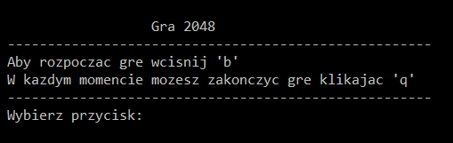
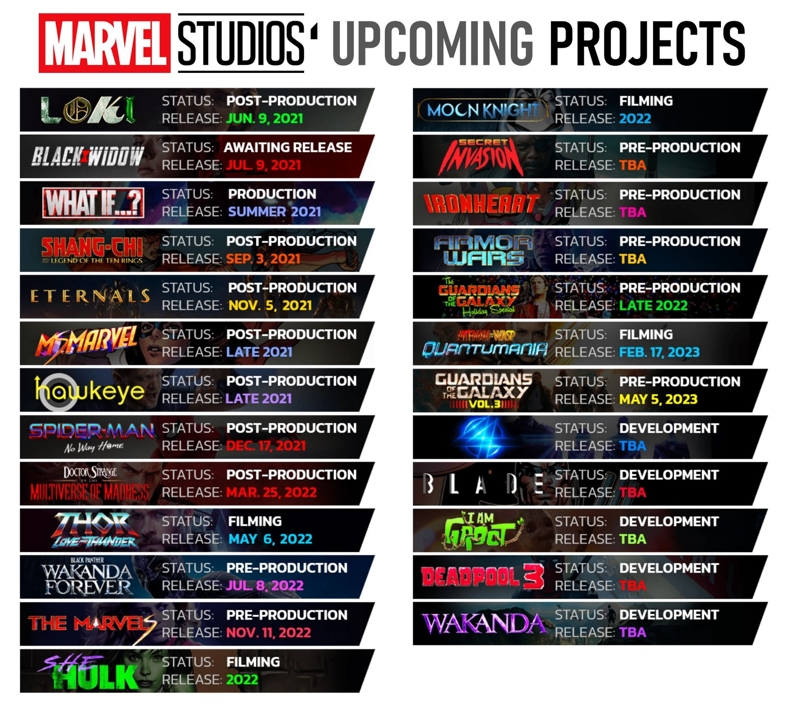
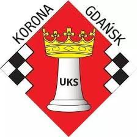
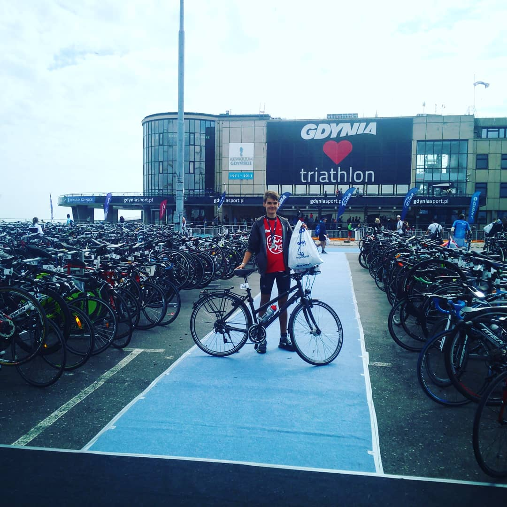

# More about me . . .

### My team project with GitY
  
Together with [kingawr123](https://kingawr123.github.io),
[jakubbanach](https://jakubbanach.github.io),
[MilSmo](https://milsmo.github.io) and 
[NarzeKajka](https://narzekajka.github.io) 
we created an ‘alpha’ version of the popular game called 2048. 
This game is some kind of a kludge. You don’t have to worry 
about any special equipment or hardware since everything happens
 in the computer console. In the future, as we become more advanced programmers,
we are planning to improve the interface and correct errors. 
We encourage you to give our game a try!
Don’t forget to share your opinion in the [survey](https://forms.gle/8LsUe4iHzi6yNTHv7).
Thanks a lot! 

### 🏬 AGH Student
[AGH main page](https://www.agh.edu.pl/)

### 🎬 Star Wars and MCU fan
  
MCU Projects in 4 Phase  

### ♚ Chess
♙ Club - UKS KORONA GDAŃSK  
  
♙ [My chess profile](http://www.cr-pzszach.pl/ew/viewpage.php?page_id=1&zwiazek=&typ_czlonka=&pers_id=40968)  
♙ [My fide profile](https://ratings.fide.com/profile/21808651)  

### ⚽️ Sport
* Running 🏃(mainly 10 km)  
🕔 5 km - 21:37 (on Triathlon) 
🕔 10 km - 43:46  
🔜 20 km  
🔜 42.195 km  
* Triathlon 🏊‍♂️ 🚴‍♂️ 🏃 
🥇Iron Man Gdynia 2019  
🕔Time: 01:34:17 
  
[More about Triathlon (my presentation)](https://prezi.com/p/wbagl9lst8ra/triathlon/)
* Other team games: ⚽️, 🏀, 🏐

### Others
🎮 Multiplayer games (Valorant, Battlefront II)  
🧩 Puzzles  
🏔 Walking in mountains  

